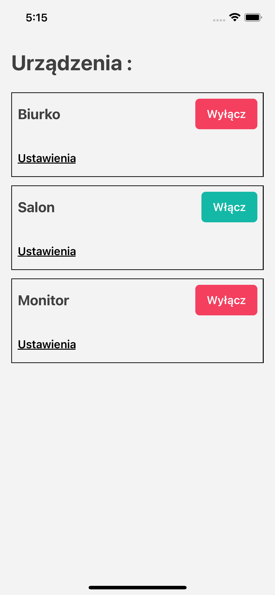
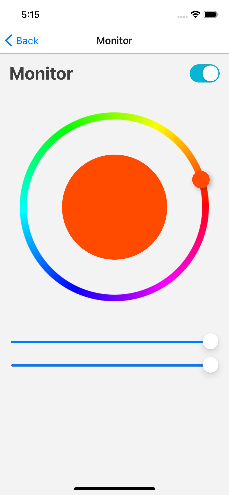

# HomeIOT controll application

## Setup

create `.env` file in the `mobile` folder that will contain all configuration
necessary to connect application with firebase.

Content:

```bash
API_KEY=key
AUTH_DOMAIN=domain
DATABASE_URL=url
PROJECT_ID=id
STORAGE_BUCKET=bucket
MESSAGING_SENDER_ID=id
APP_ID=appId
```

## Screenshots




